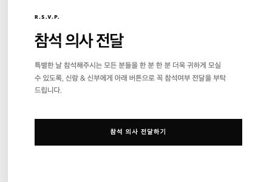
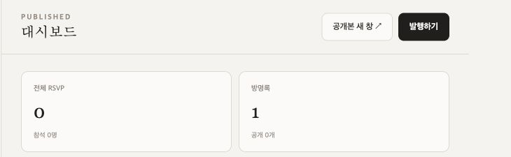
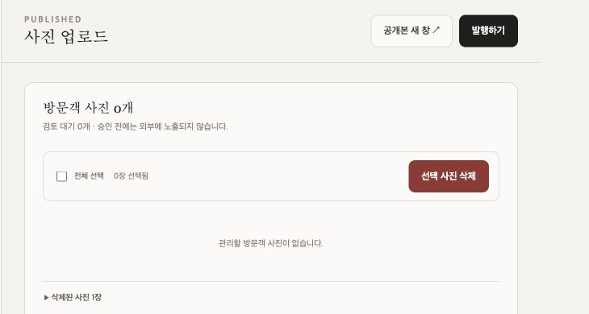

# Wedding Letter Codex

콘텐츠·디자인·미디어를 런타임에 편집할 수 있는 한국형 모바일 청첩장
플랫폼이다. 공개 청첩장, 인증된 관리자 워크스페이스, Fastify API를 하나의
모노레포로 관리한다.

- 초대장 내용을 코드에 다시 빌드하지 않고 PostgreSQL에서 편집·발행
- 사진과 음악은 S3 호환 객체 스토리지에 비공개로 저장
- draft와 published revision을 분리해 검토 후 원자적으로 공개
- Docker Compose를 기본 배포 계약으로 제공
- Vercel·Supabase를 포함한 관리형 서비스 조합으로 확장 가능한 구조

커밋된 seed와 애플리케이션 source asset에는 원본 서비스의 사적 데이터,
사진, 음악, 로고, 소스 코드를 포함하지 않는다. 실제 운영 secret과 media
URL도 저장소에 넣지 않는다. 아래 문서용 스크린샷만 운영자의 공개 요청에 따라
실제 공개 화면을 식별 정보가 드러나지 않도록 잘라 포함했다.

## 운영 화면

아래 이미지는 실제 배포본에서 캡처했다. 공개 저장소에 포함하기 위해 실명,
연락처, 계좌번호, 운영 호스트와 일정이 보이지 않는 범위만 사용했다.

| 공개 청첩장 | RSVP |
|---|---|
|  |  |

| 관리자 대시보드 | 방문객 사진 관리 |
|---|---|
|  |  |

## 포함된 기능

### 공개 청첩장

- 히어로, 인사말, 가족 연락처, 인터뷰, 달력과 실시간 카운트다운
- 연애 연혁, 갤러리, 장소·교통·외부 길찾기
- RSVP, 방명록, 계좌 복사, 선택형 배경 음악
- 예식 시각에 맞춘 방문객 사진 업로드와 승인된 사진 갤러리
- Kakao 공유, Web Share fallback, 캘린더 일정 추가
- 스크롤 reveal, dialog, reduced motion, 키보드 접근성

### 관리자

- 이름·문구·예식 일정·장소·가족 연락처 편집
- 인터뷰·연혁·디자인 토큰 편집과 모바일 실시간 미리보기
- S3 호환 스토리지 이미지·음악 업로드와 콘텐츠 슬롯 연결
- RSVP 조회·CSV 내보내기와 방명록 moderation
- 방문객 사진 승인·거절, 개별/일괄 소프트 삭제, 삭제 사진 복구
- draft revision 저장과 원자적 publish
- Secure/HttpOnly/SameSite 관리자 세션

### 백엔드

- Fastify + TypeScript REST API
- PostgreSQL migration과 JSONB content/design document
- S3-compatible private object storage
- scrypt password verifier와 해시된 session token
- public write validation과 rate limit
- readiness에서 데이터베이스와 객체 스토리지를 함께 검사

## 사용 흐름

### 방문객

1. 공개 청첩장 URL로 접속한다.
2. 일정·장소·교통편을 확인하고 RSVP를 제출한다.
3. 방명록을 작성하거나 공유 기능으로 청첩장을 전달한다.
4. 관리자가 지정한 업로드 시작 시각 이후 예식 사진을 올린다.
5. 관리자가 승인한 방문객 사진만 공개 사진 영역에 노출된다.

### 관리자

1. 관리자 화면에 로그인한다.
2. `콘텐츠 편집`, `인터뷰·연혁`, `기능·계좌`에서 초대장 내용을 수정한다.
3. `갤러리·미디어`에 사진과 음악을 올리고 각 콘텐츠 슬롯에 연결한다.
4. 각 편집 화면의 저장 버튼으로 server-side draft를 저장한다.
5. 오른쪽 모바일 미리보기에서 저장된 draft를 확인한다.
6. `RSVP 관리`, `방명록 관리`, `사진 업로드`에서 방문객 응답을 관리한다.
7. `설정·발행`에서 현재 revision을 공개본으로 발행한다.

미리보기에는 브라우저에서 아직 저장하지 않은 편집 상태가 먼저 보일 수 있지만,
발행은 서버에 저장된 draft만 대상으로 한다. 미리보기와 공개본이 달라지는 일을
막으려면 반드시 각 편집 화면의 저장 완료 안내를 확인한 뒤 발행한다. 현재
화면의 revision 표시는 저장 직후 자동 갱신되지 않으므로 안전 확인 기준으로
사용하지 않는다.

방문객 사진은 삭제해도 객체 파일과 DB 행을 즉시 제거하지 않는다. 공개
청첩장과 일반 관리 목록에서는 바로 숨겨지고, `삭제된 사진`에서 복구할 수
있다. 여러 장을 체크한 뒤 `선택 사진 삭제`로 일괄 처리할 수도 있다. 복구는
삭제 전 moderation 상태를 유지하므로, 이전에 승인된 사진을 복구하면 공개
청첩장에도 즉시 다시 나타난다.

현재 관리자 UI에는 영구 purge와 자동 보존 기간이 없다. 삭제된 사진은 운영자가
별도의 retention·purge 정책을 구현하기 전까지 DB와 객체 스토리지에 보관된다.

## 구조

```text
apps/
  api/          Fastify API, migration, seed, domain contract
  public-web/   React + Vite 모바일 청첩장
  admin-web/    React + Vite 관리자 워크스페이스
deploy/
  docker/       API와 web production image
  nginx/        public/admin SPA와 API reverse proxy
docs/
  architecture.md
  reference-audit.md
  screenshots/
docker-compose.yml
```

설계 근거는 [reference audit](docs/reference-audit.md), 런타임 구성은
[architecture](docs/architecture.md), 전체 화면 시안은
[concept board](docs/concepts/wedding-platform-concept.png)에 있다.

## 로컬 실행

Node.js 22와 Docker가 필요하다.

```bash
cp .env.example .env
# .env의 placeholder를 로컬 전용 값으로 교체
npm ci
npm run check
docker compose up -d --build
docker compose --profile tools run --rm seed
```

| 서비스 | 주소 |
|---|---|
| 공개 청첩장 | <http://localhost:8080/our-wedding> |
| 관리자 | <http://localhost:8081> |
| API readiness | <http://localhost:3000/api/health/ready> |
| MinIO console | <http://localhost:9001> |

seed는 같은 slug의 초대장이 이미 있으면 콘텐츠를 덮어쓰지 않는다. 관리자
identity와 password verifier는 `.env`의 bootstrap 값으로 생성 또는 갱신한다.
운영 데이터를 사용하는 환경에서는 seed 실행 전에 이 동작을 반드시 확인한다.
첫 로그인에는 `.env`에 입력한 `SEED_ADMIN_EMAIL`과
`SEED_ADMIN_PASSWORD`를 사용한다.

## 환경 변수

API의 핵심 런타임 계약은 다음과 같다. 실제 값은 Git에 커밋하지 않는다.

| 변수 | 설명 |
|---|---|
| `DATABASE_URL` | PostgreSQL 호환 연결 문자열 |
| `S3_ENDPOINT` | S3 호환 API endpoint |
| `S3_REGION` | 객체 스토리지 region |
| `S3_ACCESS_KEY`, `S3_SECRET_KEY` | 전용 최소 권한 S3 credential |
| `S3_BUCKET` | 비공개 미디어 bucket |
| `S3_FORCE_PATH_STYLE` | provider에 맞춘 path-style 사용 여부 |
| `ADMIN_ORIGIN`, `PUBLIC_ORIGIN` | CORS에서 허용할 두 web origin |
| `COOKIE_SECURE` | HTTPS 운영 환경에서는 `true` |
| `MAX_UPLOAD_BYTES` | API가 허용할 단일 업로드 크기 |

공개 web은 `VITE_INVITATION_SLUG`, 관리자 web은
`VITE_PUBLIC_PREVIEW_URL`을 build time에 사용한다.

## 디자인 교체

`InvitationDesign`은 PostgreSQL에서 관리하며 공개 앱이 semantic CSS custom
property로 변환한다. 색·글꼴·간격·radius·motion token을 바꿔도 콘텐츠
document와 인터랙션 코드는 유지된다. 미디어는 design token이 아니라 S3
asset reference다.

## 배포 옵션

### 지원 수준

| 구성 | 지원 수준 | 비고 |
|---|---|---|
| 로컬 Docker Compose | 바로 사용 가능 | PostgreSQL·MinIO를 포함한 개발 환경 |
| 운영 Docker images + PostgreSQL + S3 | 구성 가능 | 환경별 TLS·DNS·proxy·secret 설정 필요 |
| Vercel web 2개 + container API + Supabase | 구성 가능 | 현재 API 코드를 유지하는 권장 관리형 조합 |
| Vercel web/API + Supabase | 추가 어댑터 필요 | 현재 상태의 one-click 배포 대상은 아님 |

### Vercel web + Supabase + container API

코드 변경을 최소화하려면 공개 web과 관리자 web만 Vercel에 배포하고 API는
Docker를 지원하는 런타임에 둔다. 데이터는 Supabase PostgreSQL과 Supabase
Storage의 S3 compatibility layer를 사용할 수 있다.

1. Supabase 프로젝트를 만들고 `apps/api/migrations`를 순서대로 적용한다.
2. 장기 실행 API에는 direct connection 또는 session pooler 연결 문자열을
   `DATABASE_URL`로 설정한다.
3. 비공개 Storage bucket과 S3 access key를 만들고 Supabase dashboard에 표시된
   endpoint·region·bucket 값을 API의 `S3_*` 변수에 연결한다.
4. API에 `ADMIN_ORIGIN`, `PUBLIC_ORIGIN`, `COOKIE_SECURE=true`를 설정한다.
5. Vercel에서 public project의 Root Directory는 `apps/public-web`, admin
   project는 `apps/admin-web`로 지정하고, 두 프로젝트 모두 workspace 의존성을
   읽을 수 있도록 `Include source files outside of the Root Directory`를 켠다.
6. public project에는 `VITE_INVITATION_SLUG`, admin project에는
   `VITE_PUBLIC_PREVIEW_URL`을 build-time environment variable로 설정한다.
   slug가 기본값 `our-wedding`이면 public 변수는 생략할 수 있다.

Vercel build 설정 예시는 다음과 같다.

| 프로젝트 | Install command | Build command | Output directory |
|---|---|---|---|
| public | `cd ../.. && npm ci` | `cd ../.. && npm run build --workspace @wedding/public-web` | `dist` |
| admin | `cd ../.. && npm ci` | 아래 명령 참고 | `dist` |

관리자 앱은 `/preview/`에 공개 앱의 draft renderer도 함께 빌드해야 한다.

```bash
cd ../.. && \
npm run build --workspace @wedding/admin-web && \
npm run build --workspace @wedding/public-web -- \
  --base /preview/ \
  --outDir ../admin-web/dist/preview
```

두 Vercel 프로젝트 모두 상대 경로 `/api/*`를 사용하므로 API origin으로
rewrite해야 한다. 실제 hostname은 환경별 비공개 설정으로 관리한다.

public project의 `apps/public-web/vercel.json` 예시:

```json
{
  "$schema": "https://openapi.vercel.sh/vercel.json",
  "rewrites": [
    { "source": "/api/:path*", "destination": "https://<api-origin>/api/:path*" },
    { "source": "/(.*)", "destination": "/index.html" }
  ]
}
```

admin project의 `apps/admin-web/vercel.json`은 draft renderer의 `/preview/`
진입점을 먼저 처리한다.

```json
{
  "$schema": "https://openapi.vercel.sh/vercel.json",
  "rewrites": [
    { "source": "/api/:path*", "destination": "https://<api-origin>/api/:path*" },
    { "source": "/preview/", "destination": "/preview/index.html" },
    { "source": "/(.*)", "destination": "/index.html" }
  ]
}
```

두 설정 모두 API 규칙을 SPA catch-all보다 앞에 둔다. Vercel은 생성된 정적
파일을 먼저 제공하므로 `/assets/*`와 `/preview/assets/*`는 그대로 전달되고,
나머지 deep link만 각 `index.html`로 fallback한다. 자세한 동작은
[Vite on Vercel](https://vercel.com/docs/frameworks/frontend/vite)의 SPA
deep-linking 안내를 함께 확인한다.

관리자 앱의 세션 인증만으로 사설 접근 경계가 완성되는 것은 아니다. 운영에서는
Vercel Deployment Protection, identity-aware proxy, VPN 등 별도 접근 제어를
추가한다.

### API까지 Vercel Functions에 배포하려면

현재 API는 `app.listen()`으로 실행되는 장기 수명 Fastify 서버다. Vercel
Functions에 올리려면 다음 작업이 선행되어야 한다.

- `createApp()`을 재사용하는 serverless handler entrypoint와 `/api/*` routing
- migration을 request path가 아닌 CI 또는 별도 release job에서 한 번만 실행
- Supabase transaction pooler 사용 시 `postgres` client의 prepared statement
  비활성화와 serverless 환경에 맞춘 connection 수 제한
- Vercel request body·실행 시간 제한을 고려한 업로드 크기 재설계. 큰 사진은
  signed URL을 이용해 브라우저에서 Storage로 직접 올리는 방식을 권장
- serverless cold start, streaming response, cookie/CORS 동작에 대한 통합 테스트

즉, 데이터와 스토리지 계층은 Supabase로 교체하기 쉽지만 API 전체의 Vercel
배포는 별도의 adapter 작업 없이 지원된다고 간주하면 안 된다.

관련 공식 문서:

- [Vercel monorepos](https://vercel.com/docs/monorepos)
- [Vite on Vercel](https://vercel.com/docs/frameworks/frontend/vite)
- [Vercel Functions](https://vercel.com/docs/functions)
- [Supabase PostgreSQL 연결 방식](https://supabase.com/docs/guides/database/connecting-to-postgres)
- [Supabase Storage S3 compatibility](https://supabase.com/docs/guides/storage/s3/compatibility)

일반적인 production 준비 항목과 secret 분리는 [SETUP.md](SETUP.md)에 정리했다.

## 검증

```bash
npm run check
docker compose config --quiet
curl -fsS http://localhost:8080/healthz
curl -fsS http://localhost:8081/healthz
curl -fsS http://localhost:3000/api/health/ready
```

브라우저 QA에서는 공개 페이지의 주요 section·dialog·업로드 흐름, 관리자 로그인,
실데이터 dashboard, 발행·moderation 동작과 콘솔 오류 여부를 확인한다.

## 보안과 공개 저장소 원칙

- 실제 이름, 연락처, 계좌번호, 사진 원본과 운영 media URL을 커밋하지 않는다.
- `.env`, database password, S3 key, 관리자 bootstrap credential과 배포 token을
  커밋하지 않는다. 세션 token은 서버가 무작위로 생성하고 DB에는 digest만 저장한다.
- public write API에는 validation과 rate limit을 유지한다.
- admin mutation은 인증된 server-side session을 요구한다.
- 운영 관리자에는 애플리케이션 인증 외의 사설 접근 경계를 둔다.
- schema 변경은 `apps/api/migrations`의 forward-only SQL로 추가한다.

## 출처

초기 문제 정의와 workflow는
[revfactory/wedding-letter](https://github.com/revfactory/wedding-letter)에서
영감을 받았다. 구현은 Codex·DB 편집·독립 디자인 시스템에 맞게 새로 작성했다.
[THIRD_PARTY_NOTICES.md](THIRD_PARTY_NOTICES.md) 참조.

## License

MIT
