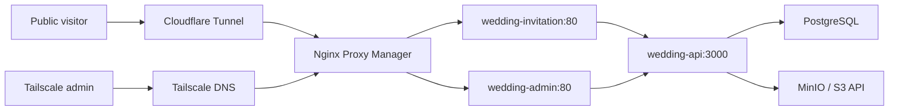

# Full-stack architecture

## Goals

- Keep invitation content, visual tokens, media, and publishing state editable
  without rebuilding the application image.
- Use one backend for the public invitation and the private admin interface.
- Use PostgreSQL as the production source of truth and MinIO for all uploaded
  media.
- Preserve the existing public routing target `wedding-invitation:80`.
- Expose the admin web container only through the Serengeti proxy network and a
  Tailscale-resolved hostname.

## Runtime topology



The Cloudflare published application routes contain only
`wedding.giraffe.ai.kr`. `wedding-admin.giraffe.ai.kr` resolves to the Serengeti
Tailscale address and is not added to Cloudflare Tunnel.

## Repository layout

```text
apps/
  api/          Fastify REST API, migrations, and tests
  public-web/   React + Vite mobile invitation
  admin-web/    React + Vite administrative workspace
deploy/
  nginx/        Public/admin static serving and API proxy configs
  docker/       Image definitions
docs/
  concepts/     Approved visual concept
  architecture.md
  reference-audit.md
docker-compose.yml      Local PostgreSQL + MinIO + application stack
docker-compose.iac.yml  Production service contract consumed by Serengeti IaC
```

## Data model

The editable invitation document is versioned as JSONB so new section types and
design tokens can be introduced without destructive schema churn. Operational
records use normalized tables.

| Table | Responsibility |
|---|---|
| `invitations` | Slug, status, timezone, content document, design tokens, revision |
| `media_assets` | MinIO object key, metadata, purpose, ordering, publish state |
| `rsvps` | Attendance response and optional logistics selections |
| `guestbook_entries` | Public message, password hash, moderation state |
| `guest_uploads` | Event photo object, uploader note, moderation state |
| `admin_users` | Login identity and scrypt password verifier |
| `admin_sessions` | Revocable hashed session token and expiration |
| `audit_events` | Administrative mutation history |

RSVP rows remain normalized and can be exported through the authenticated
admin API as an Excel-compatible UTF-8 CSV. Exported text cells are escaped for
CSV and protected against spreadsheet-formula execution.

The seed invitation contains generic placeholder content only. Real names,
contacts, accounts, photographs, and music are created through the admin
interface or a private production seed.

## Content document

The JSONB document is validated at every write and contains:

- couple and family contact groups, explicitly keyed by partner side and
  partner/father/mother relationship
- event date, timezone, venue, navigation, and transport
- ordered section configuration and feature flags
- greeting, interview, timeline, RSVP copy, notices, and closing copy
- gallery and decorative media references
- assignable greeting, middle, closing, interview, timeline, gallery, and music
  media slots
- account groups and optional payment deep links
- music and guest-upload availability settings

Visual tokens are stored separately from content to preserve the replaceable
design-system boundary.

Older content documents that only contain a free-form contact role remain
readable. The API infers their family side and relationship at validation time,
while all newly saved content uses the structured fields.

## Security

- Admin uses a Secure, HttpOnly, SameSite=Strict session cookie.
- Session tokens are random, and only their SHA-256 digest is stored.
- Password verifiers use Node's built-in `scrypt` with a unique salt.
- Public write endpoints are schema-limited and rate-limited.
- Guestbook author passwords are scrypt verifiers, never plaintext.
- MinIO credentials and database URLs are runtime environment variables.
- Uploaded objects are private; the API authorizes and streams public and admin
  previews. MinIO's internal hostname is never redirected to a browser.
- The draft preview renderer is served from the admin origin. Its initial
  document and media requests use authenticated admin endpoints, so an
  unpublished draft is never exposed through the public invitation host.
- SVG and active HTML uploads are rejected in the first release.
- Public invitation responses omit private admin metadata and moderation state.

## Local development

Docker Compose supplies PostgreSQL, MinIO, and a bucket initializer. The public
and admin Vite development servers use the same API container. A local seed
command creates a generic invitation and one admin user using values from
`.env`.

The production compose does not create PostgreSQL or MinIO. It connects the API
to Serengeti-managed services and uses Docker secrets/environment injection
defined in the private IaC repository.

## Publishing model

Admin edits increment a draft revision. Publishing copies the validated draft
document and design tokens into the public revision in one transaction. Public
requests use the published revision only, preventing partial edits from leaking
to guests.

That transaction also locks the invitation and its media rows. Only assets
referenced by the validated draft become public; previously published assets
that are no longer referenced return to draft state. A missing or archived
reference rejects the entire publish operation with no revision or media-state
change.

The admin image also contains the public renderer at `/preview/`. It loads a
server-validated draft from `GET /api/admin/invitations/:id/preview`, then
receives unsaved content and design changes from the same-origin admin parent
with an invitation-scoped `postMessage`. The embedded preview has a unique URL
per admin session to prevent browser scroll restoration from reopening it at a
stale position. Preview submissions and sharing side effects are disabled;
the separately opened public URL continues to show only the published revision.

Initial implementation may expose save-and-publish as one explicit action while
retaining draft/published fields in the schema.

The admin workspace edits every content group independently, connects uploaded
assets to typed media slots, and publishes only after the draft passes the same
schema used by public reads. Media state is owned by publication rather than by
an independent admin toggle. Assets referenced by either the saved draft or the
current public revision cannot be deleted; deletion and publication serialize
on the same invitation lock so concurrent requests cannot break the public
document. The admin UI mirrors these server-enforced rules and identifies draft
and public connections separately.
